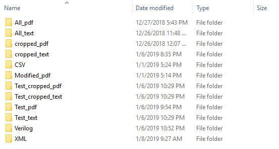

# FASoC Datasheet-Scrubber
The FASoC Datasheet Scrubbet is a utility that scrubs through large sets of PDF datasheets/documents in order to extract key circuit information. The information gathered is used to build a database of commercial off-the-shelf (COTS) IP that can be used to build larger SoC in the FASoC design. More information [here](https://fasoc.engin.umich.edu/datasheet-scrubber)
You can do Datasheet Scrubbing by running Datasheet_Scrubbing.py, which you can input a datasheet (between one of ADC, CDC, DCDC, PLL, LDO, SRAM, Temperature Sensor, BDRT, Counters, DAC, Delay_Line, Digital Potentiometers, DSP, IO, Opamp categories) and observe the extracted specs and pins. Instruction steps of each of these would be as follows:
### Environment
We need python 3.7 for this part. Moreover we need these libraries that you can use pip to install in PowerShell/terminal.
- install and upgrade pip: python -m pip install --upgrade pip
- pip install pandas
- pip install -U scipy
- pip install matplot
- pip install matplotlib
- pip install pdfminer.six
- pip install pypdf2
- pip install request
- pip install lxml
- pip install tabula-py
- pip install sklearn
- pip install regex
- pip install keras
- pip install tensorflow
- pip install pdf2image
- pip install pillow
- pip install pytesseract
- pip install -U numpy
- pip install opencv-python

Here we propose two different approaches:
- Categorition using Bag of words, text extraction using regular expression, and table extraction using tabula (please see [here](https://github.com/chezou/tabula-py) for more information)
- Categorition, text extraction, and table extraction using Convolutional neural network (CNN) (please see [here](https://en.wikipedia.org/wiki/Convolutional_neural_network) for more information)
 - If you want to test the CNN part, we need more softwares:
  - Poppler
  - Tesseract

### Getting Started
These are steps for compiling codes:
1. Clone the datasheet-scrubber repository
```bash
git clone 
```
2. Go to [here](https://www.dropbox.com/s/ixrf3t2dl1a9p4s/All_pdf.zip?dl=0) and download (All_pdf.zip should be downloaded)

3. Run make init which runs Initializer.py. It will ask you to type All_pdf.zip directory, your work directory, and your code dirrectory (for datasheet scrubbing) that you have just cloned. After running initializer.py you should see something like this.



4. All_pdf, All_text, cropped_pdf, and cropped_text are training directories. For addign more files to training set put your labeled pdf files in All_pdf directory (it means put ADC datasheets in ADC folder inside All_pdf, CDC datasheet in CDC folder inside All_pdf and so on).

5. Run make categorizer which runs test_confusion_matrix.py and shows the confusion matrix of our categorizer on whole dataset.

6. Put pdf files of datasheets that you want to test in Test_pdf folder and please email them to fayazi@umich.edu in order to have a better repository.

7. Run make extraction which runs Datasheet_Scrubbing.py which you can input a datasheet (between one of ADC, BDRT, CDC, counters, DAC, DCDC, Delay_Line, Digital_Potentiometers, DSP, IO, LDO, Opamp, PLL, SRAM, Temperature Sensor categories) and observe the extracted specs and pins. 

### Contributing
Extracted datasheets can be emailed to fayazi@umich.edu in order build a bigger repository.
