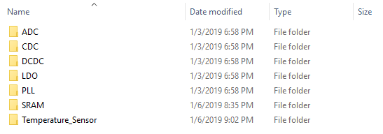

# FASoC Datasheet-Scrubber
The FASoC Datasheet Scrubbet is a utility that scrubs through large sets of PDF datasheets/documents in order to extract key circuit information. The information gathered is used to build a database of commercial off-the-shelf (COTS) IP that can be used to build larger SoC in the FASoC design. More information [here](https://fasoc.engin.umich.edu/datasheet-scrubber)

You can do Datasheet Scrubbing by running Datasheet_Scrubbing.py, which you can input a datasheet (between one of ADC, CDC, DCDC, PLL, LDO, SRAM, Temperature Sensor categories) and observe the extracted specs and pins. Instruction steps of each of these would be as follows:

### Getting Started
These are steps for compiling codes:
1. Clone the datasheet-scrubber repository
```bash
git clone 
```
1. Make a work directory similar to Fig. 1 and update the working directory path in `Address.txt` (replace the current line of Address.txt, which is C:\Users\morte\Box Sync\Education_tools\project_python_document with your directory.)

 

2. Inside All_pdf, create folders similar to Fig. 2.

 

3. All_pdf, All_text, cropped_pdf, and cropped_text are training directories. For making your training dataset, put your labeled pdf files in All_pdf directory (it means put ADC datasheets in ADC folder inside All_pdf, CDC datasheet in CDC folder inside All_pdf and so on).
4. Open and run make_training_set function to make appropriate files in All_text, cropped_pdf, and cropped_text.
5. Put pdf files of datasheets that you want to test in Test_pdf folder and please email them to fayazi@umich.edu in order to have a better repository.
6. Open and run Datasheet_Scrubbing.py which you can input a datasheet (between one of ADC, CDC, DCDC, PLL, LDO, SRAM, Temperature Sensor categories) and observe the extracted specs and pins. 

### Contributing
Extracted datasheets can be emailed to fayazi@umich.edu in order build a bigger repository.
