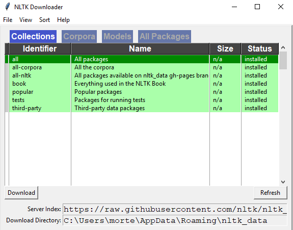

# FASoC Datasheet-Scrubber

The FASoC Datasheet Scrubber is a utility that scrubs through large sets of PDF datasheets/documents in order to extract key circuit information. The information gathered is used to build a database of commercial off-the-shelf (COTS) IP that can be used to build larger SoC in the FASoC design. More information [here](https://fasoc.engin.umich.edu/datasheet-scrubber). You can do Datasheet Scrubbing by running `Datasheet_Scrubbing.py`, which you can input a datasheet and observe the extracted specs and pins.

# Database

The FASoC database contains more than 700,000 records of Integrated Circuits (ICs) components collected from [Digikey](https://www.digikey.com/products/ics/en). 
### Database Web Application

In order to access a sample of this collection, visit our [web application](https://fasoc.herokuapp.com/) or proceed [here](https://github.com/idea-fasoc/datasheet-scrubber/tree/master/src/Web-app-db).
### Raw Database
To have access to the entire collection of components, please visit [here](https://github.com/idea-fasoc/datasheet-scrubber/tree/master/Database).

### Datasheet-Scrubber Environment

Python 3.7 or anaconda 3 is required, older versions of Python will not work. You will also need the following Python libraries which can be installed via pip (in PowerShell/terminal).

1. Install and upgrade pip: `python -m pip install --upgrade pip`

2. Install Python dependencies: **You may replace `pip` with `conda` if you are working with anaconda**
	```
	pip install pandas
	pip install -U scipy
	pip install matplot
	pip install matplotlib
	pip install pdfminer.six
	pip install pypdf2
	pip install request
	pip install lxml
	pip install tabula-py
	pip install sklearn
	pip install regex
	pip install keras
	pip install tensorflow
	pip install pdf2image
	pip install pillow
	pip install pytesseract
	pip install -U numpy
	pip install opencv-python
	pip install gensim
        pip install nltk
	```
Here we propose two different approaches:
- Categorization using Bag of words, text extraction using regular expression, and table extraction using tabula (please see [here](https://github.com/chezou/tabula-py) for more information)
- Categorization, text extraction, and table extraction using Convolutional neural network (CNN) (please see [here](https://en.wikipedia.org/wiki/Convolutional_neural_network) for more information)
   - If you want to test the CNN part, we need more software:
     - Poppler
     - Tesseract
     - Visual Studio 2017

### Getting Started For Datasheet Scrubber

These are steps for compiling codes:
1. Clone the [datasheet-scrubber repository](https://github.com/idea-fasoc/datasheet-scrubber)
	```bash
	git clone https://github.com/idea-fasoc/datasheet-scrubber.git
	```

2. Go to [here](https://www.dropbox.com/s/ad4nolrpxx4pks6/All_pdf.zip?dl=0) and download (All_pdf.zip should be downloaded)

3. Run make init which runs Initializer.py. It will ask you to type All_pdf.zip directory, your work directory, and your code dirrectory (for datasheet scrubbing) that you have just cloned. After running initializer.py you should see something like this.


Also when this window will pops up, press download.



4. All_pdf, All_text, cropped_pdf, and cropped_text are training directories. For addign more files to training set put your labeled pdf files in All_pdf directory (it means put ADC datasheets in ADC folder inside All_pdf, CDC datasheet in CDC folder inside All_pdf and so on).

5. Run make categorizer which runs test_confusion_matrix.py and shows the confusion matrix of our categorizer on whole dataset.

6. Put pdf files of datasheets that you want to test in Test_pdf folder and please email them to fayazi@umich.edu in order to have a better repository.

7. Run make extraction which runs Datasheet_Scrubbing.py which you can input a datasheet (between one of ADC, BDRT, CDC, counters, DAC, DCDC, Delay_Line, Digital_Potentiometers, DSP, IO, LDO, Opamp, PLL, SRAM, Temperature Sensor categories) and observe the extracted specs and pins.

### Contributing

Extracted datasheets can be emailed to fayazi@umich.edu in order build a bigger repository.
