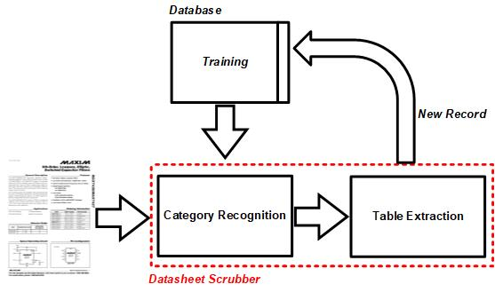

The source code of our modules can be fined here. We have three main modules.

 - Category-Recognition: Recognize the category of datasheet e.g. ADC, PLL, etc.
 - Table Extraction: Identifying the tables and extract information within them. These information are mostly specifications of the datasheets such as INL for ADC or nominal frequency for PLL.
 - Database: The entire collection of components of IC category in Digikey that we use them for training our model. 
 
 If a new datasheet has been input to our scrubber, after recognozing the category, the specifications will be extracted by the table extractor and eventually it will be added to the database. 
 
 
